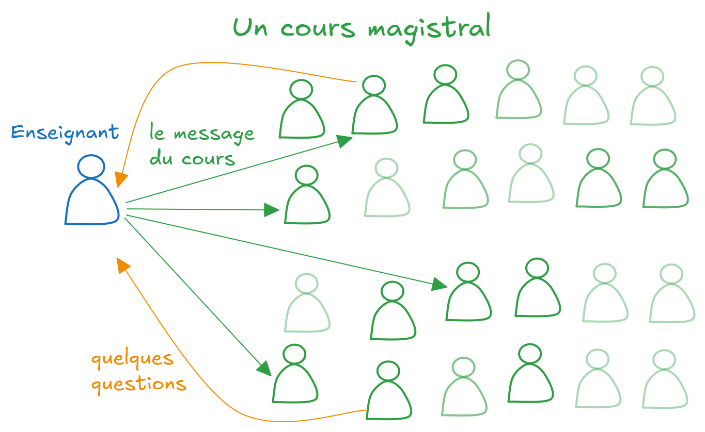
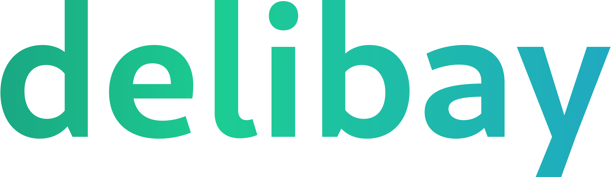
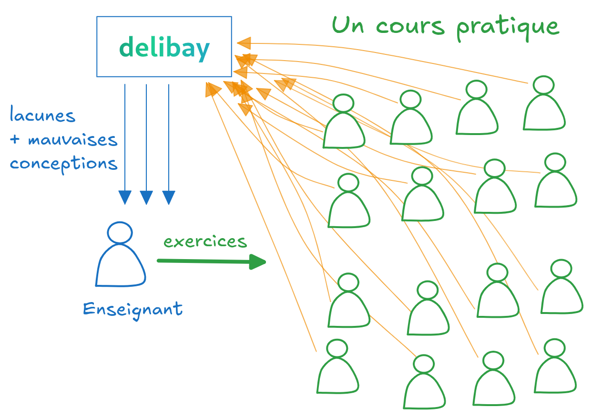
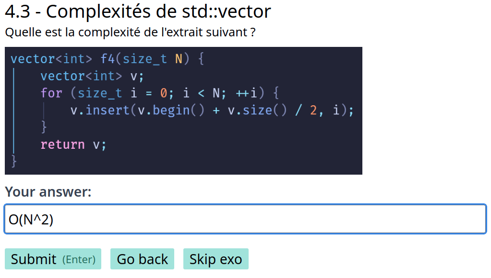
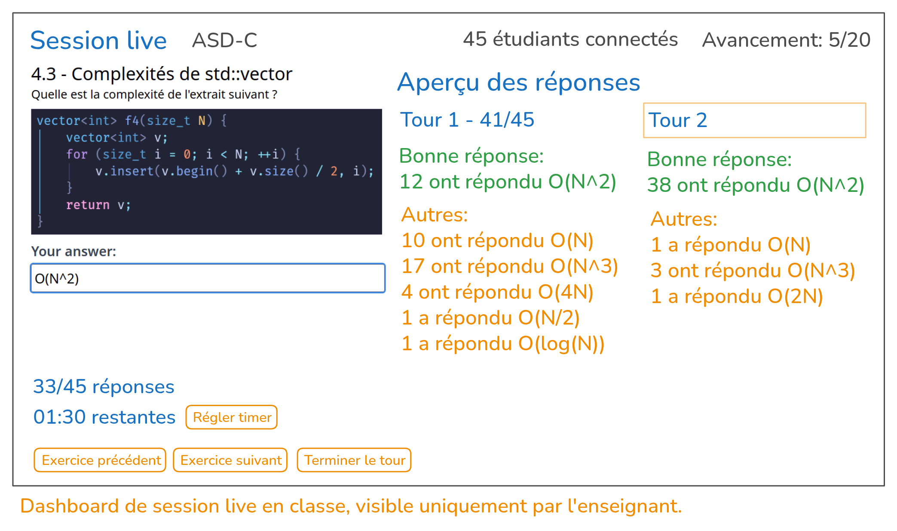
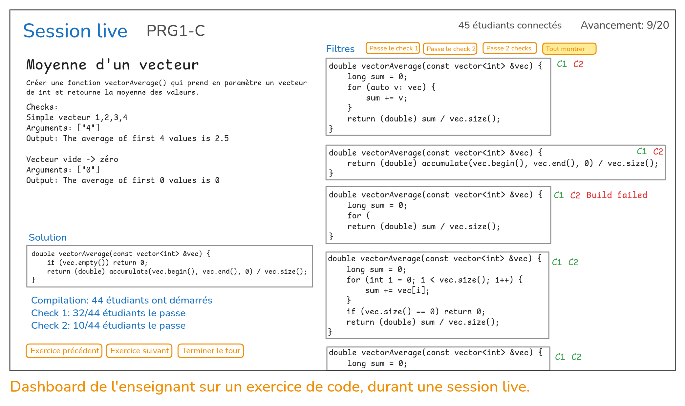

<h1 class="!text-[28px] xs:!text-[35px] md:!text-[40px] sm:!bg-red-500 md:bg-blue-500">Vous enseignez l'informatique ou la programmation?</h1>

## Vous êtes-vous déjà retrouvé dans la situation suivante ?

Vous avez mis beaucoup d'effort dans vos slides et vous tentez d'expliquer votre sujet au mieux. Vous finissez un chapitre.

> Des questions ? ... C'est clair ⁉️

*... quelques hochements de tête 🙂‍↕️, quelques visages faisant la moue 🫤, une partie n'écoute pas 🙉*

### ... et vous ne savez pas si le message passe vraiment ou comment mieux le transmettre !?

Vous avez peut-être remarqué que
- Vous avez de **la peine à capter l'attention** et à maintenir une interaction avec vos classes
- Seulement **une faible portion des étudiants posent des questions**, souvent les plus passionnés ou les plus à l'aise
- Une majorité **décroche après 15-30 minutes**
- Une partie de la classe **est paumée, mais ne sait pas quoi poser comme question**
- Même les étudiants convaincus d'avoir compris ont parfois mal compris ?
- Ce n'est que très tard à la correction des évaluations que vous vous rendez compte du problème

Les étudiants peinent à suivre une explication de trop haut niveau et les enseignants n'arrivent pas à avoir une vision précise de la compréhension de la classe ? **Comment peut-on éclaircir tout ce brouillard des 2 côtés ?**

## Et si vous faisiez **pratiquer vos étudiants en cours** pour **comprendre leurs lacunes** en récupérant leurs réponses, afin de *corriger immédiatement leur modèle mental* ?

C'est là qu'intervient notre solution **qui a pour mission de redéfinir l'expérience d'apprentissage à l'informatique.** 

**Delibay permet à tous les étudiants d'être actifs et engagés** dans leur apprentissage en classe. Vous lancez des exercices, les étudiants y répondent, Delibay synthétise les réponses et vous permet d'adapter votre cours en temps réel pour adresser les mauvaises conceptions. **Cette pratique régulière et ce feedback immédiat sont la clé pour que vos étudiants apprennent profondément et efficacement !**

> Donc c'est juste une énième plateforme de quiz ?

Sur Delibay, l'expérience n'a rien à voir avec Socrative, Moodle ou Kahoot!. Dans cette plateforme open-source dédiée à l'informatique, vous trouverez des questions de concepts (réponses courtes ou longues), des vrai/faux et des choix multiples, avec une **colorisation avancée du code**!

> Comment ça ? Voir les réponses de *TOUS* les étudiants ça fait beaucoup !

Delibay permet de regrouper les réponses pour rapidement les visualiser et décider du feedback à donner. Voici un exemple avec une question à réponse courte.

> C'est bien, mais pour notre cours de C++ on a besoin de faire du code aussi !

Vous pourrez aussi lancer des exercices de programmation dans une session live en classe. **Tous les exercices sont validés par des suites de tests automatisés**. Visualiser en un clin d'oeil l'état de progression et le code de vos étudiants.

> C'est comme codecheck.io ou d'autres suites de tests en ligne en fait ? C'était vraiment lent dans mon souvenir...  
> L'expérience de coder dans des éditeurs simplifiés en ligne, c'est pénible ! Pas d'auto-complétion, pas d'erreurs visibles...

**Le code est développé et exécuté en local** pour bénéficier d'un **maximum de vitesse** de compilation. Coder localement signifie aussi de bénéficier d'une **expérience d'IDE** complète, de pouvoir choisir son éditeur et le configurer à souhait !

> Okay, mais j'ai envie de gérer mon contenu localement et de ne pas dépendre d'encore une autre plateforme web !

Avec Delibay, vous gérez votre contenu localement via des fichiers texte dans un repository Git, qui est ensuite déployé sur Delibay. Le cours déployé se synchronise à chaque `git push`! Plus besoin de perdre du temps à faire des exports en PDF, envoyer sur Moodle ou Teams et à avertir vos étudiants.

> Des fichiers textes ? Du YAML ? Du Markdown ? Me dites pas que vous faites ça en JSON ?

Pour permettre une rédaction et maintenance la plus efficace possible, nous avons inventé une nouvelle syntaxe nommée DY, à mi-chemin entre le Markdown et le YAML. Voici un exemple de définition de 2 checks pour l'exercice de code visible sur le dashboard précédent.

<label class="font-mono px-3 ml-3 rounded-sm border border-b-0 border-#222436 rounded-br-none rounded-bl-none !w-min">exo.dy</label>
<!--  -->
<pre class="!p-5 !my-0 !bg-[#222436] break-words whitespace-pre-wrap overflow-hidden" style="font-family: 'Fira Code', monospace; display: block;">
exo Moyenne d'un vecteur
Créer une fonction <code>vectorAverage()</code> qui prend en paramètre un vecteur de int et retourne la moyenne des valeurs.

check Simple vecteur 1,2,3,4
args 4
see The average of first 4 values is 2.5

check Vecteur vide -> zéro
see The average of first 0 values is 0
</pre>

## Nos services

En plus de l'hébergement de l'infrastructure, nous vendons également des services pour répondre aux problèmes suivants.

> Intéressant... mais j'ai déjà un recueil d'exercices en PDF et j'ai la flemme de passer des heures à les migrer...

> J'aimerai bien faire plus d'exercices en classe, mais je n'ai pas le temps de créer tous ces exercices !

> C'est difficile de créer des questions challengeantes pour les étudiants... parce qu'en tant qu'expert, c'est difficile de se mettre dans la peau des étudiants et de cerner leurs incompréhensions.

    <h3>Migration de votre cours</h3>
    
Nous nous chargeons de migrer tous vos exercices sur Delibay. Nous ajouterons le support de nouveaux langages de programmation ou types d'exercices si besoin.  Vous n'avez qu'à publier le contenu existant sur un repository Git et nous nous occupons du reste!

    <h3>Création d'exercices sur mesure</h3>
    
Nous nous chargeons de créer des exercices variés qui poussent les étudiants dans leurs retranchements. Vous n'avez plus qu'à relire et choisir lesquels sont les plus pertinents à chaque session de cours. 
    Les propositions et vos retours se font dans des pull requests sur un repository Git public.
    

    <h3>Amélioration continue de vos exercices</h3>
    
Nous nous chargeons d'analyser les statistiques des réponses et de lire les réponses textuelles, pour améliorer la qualité des exercices. Nous nous occupons de détailler des solutions, d'agrémenter de schémas, d'imaginer des métaphores ou de vulgariser des concepts abstraits.

<h2 class="gradient">Prêt à rendre vos cours interactifs et engageants ?</h2>

Delibay est en cours de développement, nous vous informerons une fois la première version publiée.

<form
  action="https://www.formbackend.com/f/15195317ca0eef63"
  method="POST"
  class="w-full md:mx-32 lg:mx-60"
>
  <label for="name" class="">Nom complet</label>
  <input class="border border-blue-500 rounded-sm" type="text" id="name" name="name" required>  
  <label for="email" class="">Email</label>
  <input class="border border-blue-500 rounded-sm" type="email" id="email" name="email" required>  
  <label for="email" class="">Remarque (optionnelle)</label>
  <textarea class="border border-blue-500 rounded-sm" type="email" id="remark" name="remark" placeholder="Quels challenges avez-vous actuellement dans votre enseignement sur lesquels Delibay pourrait vous aider ? Quels cours enseignez-vous et dans quelle école ?" rows="5">
</textarea>
   
  <button type="submit" class="gradient border-2 border-gray-300 px-2 rounded-sm">Submit</button>
</form>

