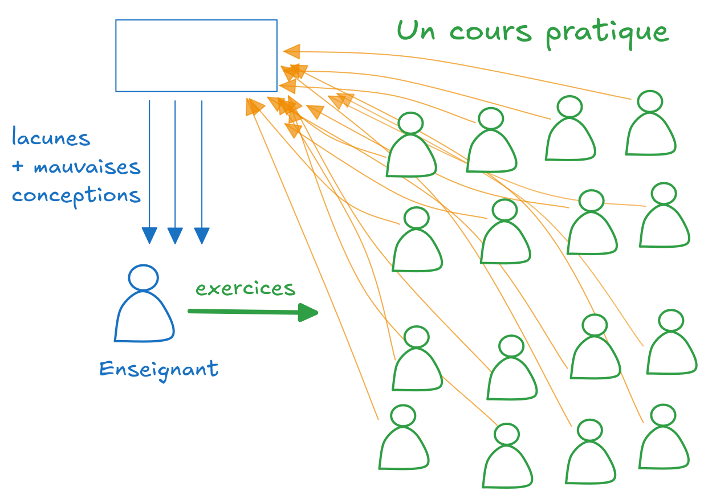

<h1 class="!text-[28px] xs:!text-[35px] md:!text-[40px] sm:!bg-red-500 md:bg-blue-500">Vous enseignez l'informatique/la programmation?</h1>

## Etes vous déjà retrouvé dans la situation suivante ?

Vous donnez votre cours comme d'habitude face à un auditoire...

> Des questions ⁉️ C'est clair ?

*... quelques hôchements de tête 🙂‍↕️, quelques visages faisant la moue 🫤, une partie n'écoute pas 🙉, quelques questions de temps en temps...*

### ... mais ne savez pas si le message passe vraiment ou comment mieux expliquer ?

Seulement une faible portion des étudiants les plus passionnés ou les plus à l'aise posent des questions? Le reste décroche après 15minutes? Est paumé, ou fait autre chose ?

🌫️🌫️ Au final, c'est le brouillard des deux cotés, les étudiants peinent à suivre une explication trop haut niveau et les enseignements ne savent pas si ce qu'ils disent atteint sa cible. Même les étudiants convaincus d'avoir compris ont peut-être compris faux ??

... comment exclaircir les choses des 2 cotés ?

### Et si vous faisiez **pratiquer vos étudiants en cours** pour **comprendre leurs lacunes** en récupérant leurs réponses afin de *corriger immédiatement leur modèle mental* ?

> Comment ça ? Voir les réponses de *TOUS* les étudiants ? Mais ça fait beaucoup et on ne va pas faire ça par email si ?

C'est là qu'intervient notre solution 

**Delibay permet à tous les étudiants d'être actif et participer à leur apprentissage en classe.** L'enseignant lance des exercices, les étudiants y répondent, Delibay syntéthise les réponses et permet d'adapter son cours en temps réel et d'adresser les mauvaises conceptions. **Cette pratique régulière et ce feedback immédiat est la clé pour que vos étudiants apprennent profondemment et efficacement !**

> Donc c'est juste une énième plateforme de Quiz ?

Sur Delibay, l'expérience n'a rien à voir avec Socrative, Moodle ou d'autres solutions existantes. **Delibay a pour mission de rédéfinir l'expérience d'apprentissage à l'informatique.** Dans cette plateforme open-source vous trouverez des questions de concepts (réponses courtes ou longues), des choix multiples, avec une colorisation avancée du code.

les traditionnels choix multiples

Peut-être que ça ce stade, vous pensez

> J'ai envie de gérer mon contenu localement et ne pas dépendre d'une autre plateforme web !

Delibay a justement été conçu pour n'être qu'une plateforme de déploiement de vos exercices, vous gérez votre contenu localement dans Git via des fichiers textuels.

## Nos services

> Intéressant mais j'ai déjà un recueil d'exercices en PDF, j'ai la flemme de passer des heures à les migrer...

> J'aimerai bien mais je n'ai pas le temps de créer tous ces exercices !

> C'est difficile de créer des questions challengeantes pour les étudiants...

    <h3>Migration de votre cours</h3>
    
Nous nous chargeons de migrer tous vos exercices, à Delibay et d'ajuster la structure. Si nécessaire pour vos cours, nous ajouter le support de nouveaux langages de programmation ou types d'exercices.

    <h3>Création d'exercices sur mesure</h3>
    
Besoin de créer des exercices challengeants qui mixe des concepts et du code ? Difficile de se mettre dans la peau des étudiants ? 
    Nous nous chargeons de créer des exercices variés qui poussent les étudiants dans leur retranchements. Vous n'avez plus qu'à relire et choisir lesquels
    sont les plus pertinents à chaque session de cours. 
    Les propositions et vos retours se font dans des pull requests sur un repository Git public.
    

    <h3>Amélioration continue de vos exercices</h3>
    
Nous nous chargeons d'analyser les statistiques des réponses et de lire les réponses textuels, pour améliorer continuellement la qualité de la pratique de vos étudiants.

<h2 class="gradient">Prêt·e à retirer ce brouillard et passer à un cours orienté sur la pratique ?</h2>

Delibay est en cours de développement et conception, nous vous tiendrons au courant quand les 

<form
  action="https://www.formbackend.com/f/15195317ca0eef63"
  method="POST"
  class="w-full md:mx-32 lg:mx-60"
>
  <label for="name" class="gradient">Nom</label>
  <input class="border border-blue-500 rounded-sm" type="text" id="name" name="name" required>

 
  <label for="email" class="gradient">Email</label>
  <input class="border border-blue-500 rounded-sm" type="email" id="email" name="email" required>

 
  <label for="email" class="gradient">Remarque (optionnel)</label>
  <textarea class="border border-blue-500 rounded-sm" type="email" id="remark" name="remark" placeholder="Qu'est-ce qui vous intéresse dans ce projet ? Quels challenges actuels pourrait être résolu par Delibay ? Quel cours enseignez vous et dans quelle école ?" rows="5">
</textarea>
   
  <button type="submit" class="gradient border border-gray-300 px-2 rounded-sm">Submit</button>
</form>

<!-- todo  inclusif ? -->

